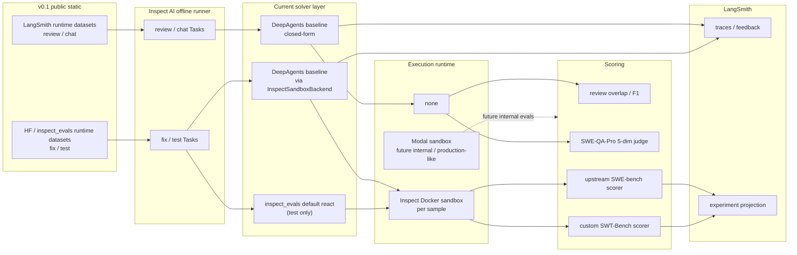

# OpenBot Eval · Product Requirements Document

> 版本：**2.1** · 起草日期：2026-05-15 · 更新日期：2026-05-16 · 状态：可执行
> 范围：OpenBot v0.1 ~ v0.3 离线 + 在线评测体系
> 上位：[`openbot-prd.md`](./openbot-prd.md) §8 · 子文档：[`openbot-eval-suites.md`](./openbot-eval-suites.md)（每 cell 详细字段）

本 PRD 锁定 eval 体系**对外承诺**。dev plan 写"怎么搭"，PRD 写"承诺什么 / 何时验收"。冲突以 PRD 为准。

---

## 0. 核心原则

**OpenBot eval 测产品输出（product behavior），不测模型能力（model capability）。**

eval 形态走三段，**共存于不同业务**（同一时间 Triage 可在 v0.2，Review 在 v0.1）：

| 阶段 | 数据来源 | Ground truth | 触发条件 |
|---|---|---|---|
| **v0.1 外部静态** | 公开 dataset | dataset 自带 | 立即可跑 |
| **v0.2 内部 curated** | bot 自己跑过的输出 | maintainer 手工标注 | **单业务 ≥ 200 条真实样本** |
| **v0.3 在线** | 生产流量持续采样 | 隐式信号（PR merged / thumbs / maintainer overrule） | **单业务月活 ≥ 30 repo 或 ≥ 100 交互/天** |

**不测**：模型纯能力（GSM8K / MMLU / HumanEval）· 第三方项目（不做榜单 / 不接受 submission）· 单一 benchmark 数字（SWE-bench Verified 只是发布最低过线，不是产品 KPI）。

---

## 目录

1. [Executive Summary](#1-executive-summary)
2. [三阶段 × 四业务矩阵](#2-三阶段--四业务矩阵)
3. [Phase 转换 gate](#3-phase-转换-gate)
4. [Suite 清单](#4-suite-清单)（详见 `openbot-eval-suites.md`）
5. [Non-Functional Requirements](#5-non-functional-requirements)
6. [架构与组件边界](#6-架构与组件边界)
7. [Dataset 管理](#7-dataset-管理)
8. [调度与运行模式](#8-调度与运行模式)
9. [Gating Policy（SLO 表）](#9-gating-policyslo-表)
10. [Observability · LangSmith 契约](#10-observability--langsmith-契约)
11. [Cost & Budget Guardrails](#11-cost--budget-guardrails)
12. [Reliability · Flake / Retry / Failure](#12-reliability--flake--retry--failure)
13. [里程碑与 Acceptance Criteria](#14-里程碑与-acceptance-criteria)
14. [Success Metrics](#14-success-metrics)
15. [Risks & Mitigations](#15-risks--mitigations)
16. [锁定决策](#16-锁定决策)
17. [Open Questions · References](#17-open-questions--references)

---

## 1. Executive Summary

| # | 问题 | 答案 |
|---|---|---|
| Q1 | **测什么** | 产品输出，按 **4 业务 × 3 阶段** 主矩阵（Safety 单列；SWT-Bench 为 Fix 辅助诊断） |
| Q2 | **用什么测** | Runner = Inspect AI（offline） · Trace / Online eval = LangSmith · Public benchmark sandbox = Inspect Docker · Future production-like internal sandbox = Modal |
| Q3 | **什么时候测** | Smoke · Regression · Weekly · Monthly · Release · Online 六类 trigger（§8） |
| Q4 | **达不到分怎么办** | Soft（PR warn）/ Hard（block merge）/ Release（block release）/ Online alert 四档（§9） |

---

### 1.1 当前 v0.1 已实现基线

| Surface | 当前 task entry | Runtime dataset source | Solver | Sandbox | Scorer |
|---|---|---|---|---|---|
| Review | `review_martian_baseline_crb` | LangSmith `martian_2026w20` | `deepagents_baseline` | none | Martian-compatible overlap scorer (`precision / recall / f1`) |
| Fix | `fix_swe_bench_verified_deepagents` | HF `princeton-nlp/SWE-bench_Verified` via `inspect_evals.swe_bench` | `deepagents_baseline` | Inspect Docker | upstream `swe_bench_scorer` |
| Test generation（Fix 辅助诊断） | `test_swt_bench_verified` / `test_swt_bench_verified_deepagents` | HF `eth-sri/SWT-bench_Verified_bm25_27k_zsb` via `inspect_evals.swe_bench` | upstream react / `deepagents_baseline` | Inspect Docker | custom `swt_bench_scorer` |
| Chat | `chat_swe_qa_pro_baseline` | LangSmith `chat_swe_qa_pro_v1` | `deepagents_baseline` direct-answer | none | SWE-QA-Pro 5-dim judge |

`review_martian_openbot` / `chat_swe_qa_pro_openbot` 已预留，但在真实 production workflow 落地前仍显式 `raise NotImplementedError`。  
`test_swt_bench_verified` 是 **Fix 的辅助诊断 suite**：它测“能不能写出暴露 bug 的回归测试”，不单独算一个新业务，也不替代 `fix_swe_bench_verified` 的产品成功信号。

---

## 2. 三阶段 × 四业务矩阵

一格一 suite，不重叠。详细字段见 [`openbot-eval-suites.md`](./openbot-eval-suites.md)。Reproducer 并入 Fix（reproducer 失败已经体现在 `fix_*` 的 `pass@1` 上，不独立报）。

| 业务 | v0.1 外部静态 | v0.2 内部 curated | v0.3 在线 |
|---|---|---|---|
| **Triage** | `gitbugs`<br>GitBugs pre-split test set (classification F1) | `triage_internal_v1`<br>bot 自跑 + maintainer 修正 ≥ 200 | ❌ `triage_internal_online`<br>bot 实时 vs maintainer 最终落地 label |
| **Review** | `review_codereviewbench`<br>Martian offline 50 PR | `review_internal_v1`<br>bot 真实 review comment + 三分类 ≥ 200 | ✅ `review_codereviewbench_online`<br>Martian Online（200k+ PR / 天） |
| **Fix** | `fix_swe_bench_verified`<br>SWE-bench Verified 500 | `fix_internal_v1`<br>bot 提过的 PR + merge ≥ 200 | ✅ `fix_swe_bench_live`<br>SWE-bench Live 每月新 50 |
| **Chat** | `chat_swe_qa_pro`<br>TIGER-Lab SWE-QA-Pro-Bench | `chat_internal_v1`<br>真实 @bot 问答 ≥ 200 + 三分类 | ❌ `chat_internal_online`<br>线上 @bot 采样 + LLM-judge + thumbs |


✅ 真外部 live · ❌ 必须内部（无公开 online 替代） · ⚠️ 半外部（数据外部，curation 内部）

**Fix 辅助诊断**：`test_swt_bench_verified` 与 `fix_swe_bench_verified` 共用公开 benchmark 基础设施，但测的是 regression-test generation，不纳入主矩阵的产品 cell。

---

## 3. Phase 转换 gate

Gate **单业务独立**触发。v0.2 解冻 v0.1 仍跑；v0.3 解冻 v0.2 仍跑（curated 是稳定地面真相，online 是漂移信号，并报不替换）。

### 3.1 v0.1 → v0.2 解冻

| 业务 | Gate 条件 | 解冻 suite |
|---|---|---|
| Triage | bot 在 ≥ 5 repo 跑过 ≥ 200 条 `(issue, bot_label, maintainer_final_label)` | `triage_internal_v1` |
| Review | bot 写过 ≥ 200 条 review comment + useful/noise/wrong 三分类 | `review_internal_v1` |
| Fix | bot 提过 ≥ 200 个 fix PR，含 `(issue, patch, merge_status)` | `fix_internal_v1` |
| Chat | bot 回过 ≥ 200 条 @bot 问答 + correct/partial/wrong 三分类 | `chat_internal_v1` |

### 3.2 v0.2 → v0.3 解冻

| 业务 | Gate 条件 | 解冻 suite |
|---|---|---|
| Triage | bot 日均 ≥ 50 条 triage decision | `triage_internal_online` |
| Review | bot 公开部署到 ≥ 3 OSS repo（被 CodeReviewBench Online 收录） | `review_codereviewbench_online` |
| Fix | v0.2 之后随时（仅看 SWE-bench Live 月度发布） | `fix_swe_bench_live` |
| Chat | bot 日均 ≥ 30 条 @bot interaction | `chat_internal_online` |

### 3.3 计数与解冻流程

- bot pipeline 写每次产出到 `openbot_eval_counters` 表（§10.2）。
- 月度 cron 跑 `scripts/gate_status.py` → `docs/eval/gate-status.md`。
- 解冻必须 PR 更新 §2 矩阵 + baseline run 链接 + maintainer 审批。

---

## 4. Suite 清单

完整字段见 [`openbot-eval-suites.md`](./openbot-eval-suites.md)。

| Suite | 阶段 | 业务 | Run mode | Floor |
|---|---|---|---|---|
| `gitbugs` | v0.1 | Triage | regression + weekly | macro_f1 ≥ 0.55 |
| `triage_internal_v1` | v0.2 | Triage | regression + weekly | macro_f1 ≥ 0.65 · override < 0.30 |
| `triage_internal_online` | v0.3 | Triage | nightly | macro_f1_30d ≥ 0.70 · override_30d < 0.25 |
| `review_codereviewbench` | v0.1 | Review | regression + release | mean_f1 ≥ 0.55 |
| `review_internal_v1` | v0.2 | Review | regression + release | useful_rate ≥ 0.65 |
| `review_codereviewbench_online` | v0.3 | Review | nightly | action_rate ≥ 0.40 |
| `fix_swe_bench_verified` | v0.1 | Fix | weekly + monthly + release | pass@1 ≥ 0.40 |
| `test_swt_bench_verified` | v0.1 | Fix 辅助诊断 | weekly + release | baseline-only（v0.1 不单独 gate） |
| `fix_internal_v1` | v0.2 | Fix | regression + release | pass@1 ≥ 0.50 |
| `fix_swe_bench_live` | v0.3 | Fix | monthly | pass@1 (90d) ≥ 0.35 |
| `chat_swe_qa_pro` | v0.1 | Chat | regression + release | normalized_overall ≥ 0.65 |
| `chat_internal_v1` | v0.2 | Chat | regression + release | correct_rate ≥ 0.70 |
| `chat_internal_online` | v0.3 | Chat | nightly | corr_30d ≥ 0.75 · follow_up_30d < 0.40 |

---

## 5. Non-Functional Requirements

| 维度 | 要求 |
|---|---|
| 可复现 | 任一 run 给定 `(suite_version, dataset_version, git_sha, prompt_version, model_id, judge_model_id)` 必须能 ±2σ 内复现总分 |
| 可观测 | 每个 sample 必须有 LangSmith trace 或显式记录 `trace_unavailable`；suite-level 必须有 cost / latency / step / retry / sandbox-restart 统计 |
| 隔离 | 公开 code-editing benchmark（SWE / SWT）→ Inspect Docker；未来 internal / production-like eval → Modal；closed-form review / chat → none。**不得把 benchmark sandbox 误写成生产 sandbox** |
| 成本可控 | 每个 suite run 必须声明 budget；超限自动 abort + audit log（§11） |
| 延迟 | smoke ≤ 2 min · regression ≤ 30 min · weekly ≤ 6 h · monthly ≤ 24 h · release ≤ 24 h · online refresh ≤ 1 d；超时自动 alert |
| 可治理 | judge / scorer / dataset 任一变更 → 必须重跑 baseline 并 PR review（§10.3） |
| 可审计 | LangSmith experiment 命名 + metadata 必填字段（§10）违反即 fail |
| 安全 | 内部 dataset 不混入公开 release artifact；含 PII 的 issue 必须 redact 后才入 dataset |

---

## 6. 架构与组件边界



### 6.1 目录结构（PRD 硬约束）

```text
evals/
├── common/
│   ├── datasets.py
│   ├── deepagents_baseline.py
│   ├── langsmith.py
│   └── langsmith_experiments.py
├── solvers/
│   ├── review.py
│   ├── swe_fix.py
│   ├── swe_test.py
│   ├── swe_qa.py
│   └── inspect_sandbox_backend.py
├── scorers/
│   ├── review_overlap.py
│   ├── review_judge.py
│   ├── swt_bench_scorer.py
│   ├── swe_qa_judge.py
│   └── swe_qa_pro.py
├── tasks/
│   ├── review_martian.py
│   ├── fix_swe_bench_verified.py
│   ├── test_swt_bench_verified.py
│   └── chat_swe_qa_pro.py
└── scripts/
    ├── build_review_martian_dataset.py
    ├── build_swe_bench_verified_dataset.py
    ├── build_swt_bench_verified_dataset.py
    └── build_chat_swe_qa_pro_dataset.py
```

PR 改 `evals/tasks/` · `evals/scorers/` · `evals/solvers/` · `evals/common/datasets.py` 任一文件，**强制**触发对应 regression suite（§8.2）。

### 6.2 责任边界

| 组件 | 职责 | **不**承担 |
|---|---|---|
| Inspect AI | 组织 offline run · 调度 sample · 调 solver · 调 scorer | trace 存储 · streaming online · 长期实验对比 |
| LangSmith | trace · dataset · experiment · cost · annotation · **online eval** | 跑 offline sample · 跑 sandbox · 触发 schedule |
| DeepAgents | 当前 baseline solver runtime；把任务 prompt / tool use / agent loop 跑起来 | 管理 benchmark 容器生命周期 · 定义 scorer |
| Inspect Docker sandbox | 当前 public code-editing benchmark（SWE / SWT）执行环境 | 代表真实生产 sandbox |
| Modal sandbox | 未来 internal / production-like eval 的真实 OpenBot workflow 执行环境 | 承担 public benchmark 兼容层 |
| GitHub Actions | trigger | eval 语义 / scoring |
| LiteLLM | model routing + fallback | judge 选型 |

### 6.3 无 upstream Inspect Task 的公开 benchmark wrap 规范

无 upstream Inspect Task 的公开 benchmark，按两类处理：

1. **runtime 走 LangSmith mirror**：如 Martian review / SWE-QA-Pro。build script 固定 upstream revision 后发布到 LangSmith，Task 通过 `evals.common.datasets.langsmith_dataset(...)` 读取。
2. **runtime 继续走 upstream，LangSmith 只做 mirror**：如 SWE-bench Verified / SWT-Bench Verified。Task 仍由 `inspect_evals.swe_bench.swe_bench(...)` 读取 upstream dataset；LangSmith mirror 仅用于 Experiment row 关联。
3. Solver 当前允许 baseline provider；当 `openbot.workflows.<surface>.run(...)` 落地后，production provider 必须走真实 workflow。
4. Scorer 优先复用 upstream；没有 upstream 时才包成自定义 Inspect Scorer。
5. build script / metadata 必须记录 `upstream_commit` 或 `hf_revision`，以及 mirror dataset 名称。

---

## 7. Dataset 管理

### 7.1 通用约束

1. **版本化**——LangSmith dataset 名称或 upstream revision 必须稳定可追踪；引入 v{N+1} 时**不删** v{N}。
2. **冻结输入**——LangSmith runtime dataset 必须写入 `dataset_sha256`；upstream runtime dataset 必须写入 `hf_revision` / `upstream_commit`。
3. **单一运行时真源**——每个 suite 必须明确写清自己是 `langsmith_runtime` 还是 `upstream_runtime + langsmith_mirror`，禁止双源静默 fallback。
4. **可 spot-check**——每条样本能回溯到原始 issue / PR URL 或 upstream instance id。
5. **public / private 分离**——公开与内部 trace 路由必须走 allowlist；内部 dataset 不入公开 release artifact。
6. **PII redaction**——内部 issue/PR 进 dataset 前 redact email / token / 内部 URL。

### 7.2 Dataset metadata schema

```yaml
# LangSmith example metadata（runtime mirror）
dataset_version: martian_2026w20
dataset_sha256: "<canonical payload hash>"
sample_id: martian-sentry-001
upstream_commit: "<git sha>"
public: true

# upstream runtime + LangSmith mirror metadata（SWE / SWT）
dataset_version: fix_swe_bench_verified
hf_dataset: princeton-nlp/SWE-bench_Verified
hf_split: test
hf_revision: "<revision>"
instance_id: sympy__sympy-22914
```

### 7.3 v0.1 必交付 dataset

| Dataset | 大小 | 来源 | Runtime source |
|---|---|---|
| `martian_2026w20` | 50 PR | Martian offline split | LangSmith |
| `fix_swe_bench_verified` | 500 | SWE-bench Verified mirror | upstream HF at runtime + LangSmith mirror |
| `test_swt_bench_verified` | 433 | SWT-Bench Verified mirror | upstream HF at runtime + LangSmith mirror |
| `chat_swe_qa_pro_v1` | 260 | SWE-QA-Pro-Bench mirror | LangSmith |
| `triage_oss_seed_v1` | 200 | 10 OSS repo closed issues × maintainer label | planned |
| `prompt_injection_v0` | 24 | 已有 | planned / safety |

---

## 8. 调度与运行模式

### 8.1 六类 trigger

| 模式 | 触发 | 时长上限 | 阻塞？ |
|---|---|---|---|
| Smoke | 本地 `inspect eval --limit 3-5` / PR 手动 | ≤ 2 min | 不阻塞 |
| Regression | PR 匹配 §8.2 path → 异步触发 | ≤ 30 min | 仅 §9 hard gate suite 阻塞 |
| Weekly | GHA cron 周一 02:00 UTC | ≤ 6 h | 不阻塞；趋势告警 |
| Monthly | GHA cron 每月 1 日 02:00 UTC | ≤ 24 h | 不阻塞；趋势告警 |
| Release | `workflow_dispatch` 人工触发 | ≤ 24 h | block release |
| Online | 生产流量持续采样（v0.3 cell） | 24 h refresh | 不阻塞；dashboard alert |

### 8.1.1 本地操作入口（v0.1 锁定）

eval 专属工作流统一从 `evals/Makefile` 进入；根目录 `Makefile` 只保留通用开发任务。

```bash
make -C evals data          # 首次发布 / 安全发布当前 4 个 dataset
make -C evals data-refresh  # 显式 --force 重建当前 4 个 dataset
make -C evals test          # 仅跑 tests/eval
make -C evals smoke         # 跑当前 4 条 live smoke eval
make -C evals check         # test + smoke
make -C evals view-open     # 打包本地 eval logs，起静态服务并自动打开 Inspect View
```

单 surface target（如 `smoke-fix` / `data-chat`）允许调试，但 PRD 级验收以组合 target 为准。

### 8.2 PR path matcher → 触发 suite

PR 改动 path 触发对应业务的当前 phase suite（v0.1 单跑外部；v0.2+ 追加 internal_v1）：

| 改动 | v0.1 触发 | v0.2+ 追加 |
|---|---|---|
| `workflows/review*` · `prompts/review*` | `review_codereviewbench` (limit 10) | `review_internal_v1` (limit 20) |
| `workflows/triage*` · `prompts/triage*` | `triage_oss_seed` (limit 20) | `triage_internal_v1` (limit 20) |
| `workflows/fix*` · `prompts/fix*` · `middleware/sandbox*` | `fix_swe_bench_verified` (limit 10) + `test_swt_bench_verified` (limit 10, diagnostic) | `fix_internal_v1` (limit 10) |
| `workflows/chat*` · `prompts/chat*` | `chat_swe_qa_pro` (limit 20) | `chat_internal_v1` (limit 20) |
| `evals/**` 自身改动 | 对应 suite 全量 | — |

### 8.3 Weekly / Monthly / Release / Online schedule

```yaml
# eval-weekly.yml — 周一 02:00 UTC
#   v0.1: triage_oss_seed · review_codereviewbench · fix_swe_bench_verified (limit 100)
#         test_swt_bench_verified (diagnostic) · chat_swe_qa_pro
#   v0.2+ 追加: triage_internal_v1 · review_internal_v1 · fix_internal_v1
#               chat_internal_v1

# eval-monthly.yml — 每月 1 日 02:00 UTC
#   v0.3+: fix_swe_bench_live
#          gate_status.py → docs/eval/gate-status.md

# eval-release.yml — workflow_dispatch
#   当前 phase 所有 release-tier suite + cost report 导出

# eval-online-refresh.yml — 每日 01:30 UTC（v0.3+ 解冻后启用）
#   triage_internal_online / chat_internal_online refresh
#   review_codereviewbench_online leaderboard pull
#   → docs/eval/online-dashboard.md
```

---

## 9. Gating Policy（SLO 表）

> 与 main PRD §8.5 1:1 锚定；冲突以本表为准并同步回 main PRD。

| Gate | 指标 | 阈值 | 触发 | 行为 |
|---|---|---|---|---|
| **G1** Triage seed regression | `triage_oss_seed` macro_f1 vs baseline | ↓ ≥ 5% | regression | warn |
| **G2** Review external regression | `review_codereviewbench` mean_f1 vs baseline | ↓ ≥ 5% / ≥ 10% | regression | 5%: warn / 10%: **block merge** |
| **G3** Fix Verified regression | `fix_swe_bench_verified` pass@1 vs baseline | ↓ ≥ 5% | regression | warn |
| **G4** Chat regression | `chat_swe_qa_pro` normalized_overall vs baseline | ↓ ≥ 5% | regression | warn |
| **G5** Cost ceiling | per-suite cost vs budget | > 120% | 所有 mode | abort + alert（§11） |
| **G7** Internal triage hold | `triage_internal_v1` macro_f1 / override | < 0.65 · > 0.30 | regression (v0.2+) | warn |
| **G8** Internal review hold | `review_internal_v1` useful_rate | < 0.65 | regression (v0.2+) | warn |
| **G9** Internal fix hold | `fix_internal_v1` pass@1 | < 0.50 | regression (v0.2+) | warn |
| **G10** Internal chat hold | `chat_internal_v1` correct_rate | < 0.70 | regression (v0.2+) | warn |
| **G11** Online triage drift | `triage_internal_online` macro_f1_30d / override_30d | < 0.70 · > 0.25 | nightly (v0.3+) | dashboard alert |
| **G12** Online review action | `review_codereviewbench_online` action_rate | < 0.40 | nightly (v0.3+) | dashboard alert |
| **G13** Online chat correctness | `chat_internal_online` corr_30d / follow_up_30d | < 0.75 · > 0.40 | nightly (v0.3+) | dashboard alert |
| **G14** Fix Live drift | `fix_swe_bench_live` pass@1 vs上月 | ↓ ≥ 3% | monthly | trend 告警 |

**Baseline 治理**：
- Baseline = 上一次成功 release 的分数，存在 LangSmith `experiment_tag=baseline-release-<version>`。
- judge / prompt / scorer 改动 → 必须重跑 baseline + PR review + 写 `docs/eval/baseline-log.md`。
- Dataset 升版 v{N}→v{N+1} → 同时跑两版，记 diff，再切 baseline。
- `test_swt_bench_verified` 在 v0.1 仅作 Fix 辅助诊断，不单独触发 hard/soft gate；先积 baseline，再决定是否升格为正式门槛。

---

## 10. Observability · LangSmith 契约

### 10.1 必填 run-level metadata

```text
suite_name · suite_version · dataset_version · dataset_sha256 (or upstream_commit)
git_sha · prompt_version · workflow_version
model_id · judge_model_id · judge_prompt_version
sandbox_backend (modal | inspect_docker | none)
runner_version (inspect-ai | langsmith-online-eval)
mode (smoke|regression|weekly|monthly|release|online)
phase (v0.1_external | v0.2_internal | v0.3_online)
started_at · triggered_by
```

**未填即 fail**：`scripts/validate_langsmith_run.py` 校验。

### 10.2 必填 sample-level fields

```text
sample_id · input_artifact_refs · output_artifact_refs
score_payload · tokens_in/out · cost_usd · latency_ms
step_count · tool_call_count · retry_count · sandbox_restart_count
failure_category (§12.4 固定枚举)
```

**附录：counters 表 schema**（用于 §3 gate 计数）：

```sql
CREATE TABLE openbot_eval_counters (
  id            BIGSERIAL PRIMARY KEY,
  business      TEXT NOT NULL,             -- triage | review | fix | chat
  bot_decision  JSONB NOT NULL,
  ground_truth  JSONB,                     -- 可后填
  source        TEXT NOT NULL,             -- repo full_name
  artifact_ref  TEXT NOT NULL,             -- LangSmith trace URL
  created_at    TIMESTAMPTZ NOT NULL DEFAULT now(),
  labeled_at    TIMESTAMPTZ
);
CREATE INDEX ON openbot_eval_counters (business, labeled_at);
```

### 10.3 Judge model / prompt 治理

| 动作 | 触发 | 流程 |
|---|---|---|
| Judge model 升级 | 新模型版本可用 | PR rationale → 重跑全部 release baseline → 写 `docs/eval/judge-version-log.md` → maintainer 批准 |
| Judge prompt 改动 | PR 改 `evals/common/judges.py` | 同上 |
| Scorer 改动 | PR 改 `evals/scorers/*` | 同上 + 与旧版分数对齐解释 |

每个 release `release-notes` 必须声明 judge model id + judge prompt 版本。

### 10.4 Experiment / trace 命名（PRD 锁定）

```
# 当前 coding benchmark Experiment project
{dataset_name}-{solver_family}-{YYYYMMDD-HHMMSS}

# 当前 DeepAgents sample trace
{dataset_version}/{sample_id}
```

例：`fix_swe_bench_verified-deepagents_baseline-20260516-021530` · `test_swt_bench_verified-inspect_evals_default-20260516-022012` · `fix_swe_bench_verified/sympy__sympy-22914`

**命名违反 = run fail**。

---

## 11. Cost & Budget Guardrails

### 11.1 三层 budget

```yaml
budget:
  per_sample_usd:
    triage_oss_seed: 0.05
    triage_internal_v1: 0.05
    review_codereviewbench: 0.60
    review_internal_v1: 0.20
    fix_swe_bench_verified: 1.50   # 单 instance 上限
    test_swt_bench_verified: 1.50
    fix_internal_v1: 2.50
    fix_swe_bench_live: 1.50
    chat_swe_qa_pro: 0.10
    chat_internal_v1: 0.05
  per_suite_run_usd:
    smoke: 5
    regression: 30
    weekly: 200
    monthly: 400
    release: 800
  monthly_total_usd: 1500
```

### 11.2 强制行为

| 触发 | 行为 |
|---|---|
| 单 sample > `per_sample_usd × 1.2` | abort 该 sample，`failure_category=budget_stop` |
| 单 suite run > `per_suite_run_usd` | abort 全 run + audit + alert |
| 当月累计 > `monthly_total_usd` | 暂停所有 eval workflow_dispatch；maintainer 手动 `openbot eval budget reset` 才恢复 |

### 11.3 Cost report

每次 release 必须导出 `docs/reports/eval-cost-<version>.md`：suite 总成本 / sample 数 / 平均 / 95p / 与上次 diff / top-10 异常。

---

## 12. Reliability · Flake / Retry / Failure

### 12.1 Retry policy

| 失败类型 | 重试 |
|---|---|
| Sandbox 创建失败 | 3 次指数退避 |
| LLM API 429 / 5xx | 5 次（LiteLLM 内置） |
| Judge LLM 失败 | 2 次；仍失败 → `failure_category=judge_error`，**不**剔除 |
| Scorer assertion | **不**重试，标 `scorer_bug`，开 issue |

### 12.2 Flake 处理

- run 报告独立列出 `transient_*` sample。
- 最近 3 次 run 内同 sample ≥ 2 次 transient → 标 `flaky`，从聚合剔除，保留 raw。
- `flaky` sample 列入 `docs/eval/flaky-samples.md`，每月人工 review。

### 12.3 Suite-level abort

transient sample 占比 > 20% → 自动 abort 整个 run，不出聚合分。

### 12.4 `failure_category` 固定枚举

```
setup_failure · sandbox_error · agent_failure · test_failure
budget_stop · timeout · judge_error · scorer_bug
transient_network · transient_modal · flaky
```

LangSmith schema 必须用这套枚举，**严禁**自由文本。

---

## 14. 里程碑与 Acceptance Criteria

### E0 · 设计冻结（已完成）

PRD merge · `evals/` 骨架 · `baseline-log.md` / `judge-version-log.md` 空模板 · `validate_langsmith_run.py` 占位。

### E1 · v0.1 最小闭环

- [ ] `inspect-ai` + `inspect-evals` 接入
- [ ] `evals/{common,solvers,scorers}` skeleton
- [ ] `review_codereviewbench` 5 条 sample 跑通 + LangSmith 上报
- [ ] `fix_swe_bench_verified_deepagents` 5 条 sample 跑通 + LangSmith Experiment 投影
- [ ] `test_swt_bench_verified_deepagents` 5 条 sample 跑通 + LangSmith Experiment 投影
- [ ] `chat_swe_qa_pro_baseline` 5 条 sample 跑通 + LangSmith feedback
- [ ] `scripts/export_run_summary.py` 输出首份 summary

**验收**：本地 `make -C evals smoke` 一条命令跑通 4 条已实现 surface 的 5-sample smoke；`make -C evals test` 通过；每条 run 的 trace / score / cost / artifact / metadata 符合契约。

### E2 · v0.1 全量上线

- [ ] `triage_oss_seed` 200 条 + baseline
- [ ] `review_codereviewbench` 50 PR + mean_f1 baseline
- [ ] `fix_swe_bench_verified` 500 题 release + 100 题 weekly
- [ ] `test_swt_bench_verified` 433 题 release baseline + weekly diagnostic
- [ ] `chat_swe_qa_pro` + baseline
- [ ] `compare_runs.py` + §9 阈值 · counters 表上线

**验收**：每个业务在 release report 都有一行公开数字；PR path 改动自动跑对应外部 suite regression。

### E3 · 调度与报告

- [ ] 4 个 GHA workflow（regression / weekly / monthly / release）上线
- [ ] PR comment 贴 §9 gate 结果 · summary 自动导出到 `docs/reports/`
- [ ] cost dashboard + flaky 自动标记
- [ ] `gate_status.py` 月度回写

### E4 · v0.2 解冻（按 §3.1 单业务独立）

每业务到 200 后：标注 → dataset_v1.jsonl + manifest → task → baseline → 加入 §8.2 matcher + §9 G7-G10 → PR 更新 §2 矩阵。

### E5 · v0.3 解冻（按 §3.2 单业务独立）

- [ ] `triage_internal_online` / `chat_internal_online` LangSmith online eval
- [ ] `review_codereviewbench_online` Martian leaderboard API
- [ ] `fix_swe_bench_live` monthly cron
- [ ] `docs/eval/online-dashboard.md` 每日 refresh

---

## 15. Success Metrics

### 15.1 Eval system 自身 KPI

| KPI | Target |
|---|---|
| 任一 release suite 复跑偏差 | ≤ 2σ |
| LangSmith metadata 校验通过率 | 100% |
| Smoke 总耗时 | ≤ 2 min |
| Weekly 总耗时 | ≤ 6 h |
| Suite run 因 budget abort 率 | < 5% |
| Flaky sample 占比 | < 3% |

### 15.2 给 OpenBot 产品的信号

| 业务 | v0.1 外部 Floor | v0.2 内部 Floor | v0.3 online Floor |
|---|---|---|---|
| Triage | macro_f1 ≥ 0.55 | macro_f1 ≥ 0.65 · override < 0.30 | macro_f1_30d ≥ 0.70 · override_30d < 0.25 |
| Review | mean_f1 ≥ 0.55 | useful_rate ≥ 0.65 | action_rate ≥ 0.40 |
| Fix | pass@1 ≥ 0.40 | pass@1 ≥ 0.50 | pass@1 (90d) ≥ 0.35 |
| Chat | normalized_overall ≥ 0.65 | correct_rate ≥ 0.70 | corr_30d ≥ 0.75 · follow_up_30d < 0.40 |

**每个 release 必须报当前 phase 已解冻的所有 cell**——一个业务可同时报 v0.1+v0.2，或 v0.2+v0.3，不跳低 phase。

---

## 16. Risks & Mitigations

| Risk | L | I | Mitigation |
|---|---|---|---|
| 把模型能力当产品能力测，分数好看但没人用 | H | C | §0 原则；release report 强制并列报 internal curated / online |
| 内部 eval 不走真实 workflow，分数虚高 | M | H | §6 强制 solver 走 `openbot.workflows.*`；review checklist |
| Judge model 漂移 → baseline 不可比 | M | H | §10.3 治理；release 锁版本；升级走 PR + baseline 重跑 |
| Dataset 静默变更 | L | H | §7.2 dataset metadata + `dataset_sha256` / `hf_revision`；升级走显式版本 |
| 所有 suite 都 PR gate → CI 爆 | M | M | §9 只有 G2-10%/G5 hard gate |
| Public Inspect Docker vs future internal Modal 行为差异 | M | M | §6 双 runtime 策略 + `sandbox_backend` 字段记录；public 分数不冒充 production-like 分数 |
| SWE-bench Verified 过拟合 | H | M | Live + internal_v1 + online 三路并报；release report 诚信声明 |
| Cost 失控 | M | H | §11 三层 budget + 自动 abort + monthly hard kill |
| Flaky sample 污染聚合 | M | M | §12.2 标记 + 自动剔除 + 月度 review |
| 安全测试缺失 | M | C | v0.1+ 依赖外部 redteam / 第三方评估 |
| 把 LangSmith 当 offline runner 用 | M | H | §6.2 责任边界硬性化；PR review 盯死 |
| 公开 benchmark upstream 不稳定 | L | M | commit hash 锁版本；wrap 类记 upstream_commit；升级走 PR |
| §3 gate 计数错误 → 解冻误触发 | L | M | §10.2 counters + 月度 gate_status + PR review 解冻 |
| v0.3 online ground truth 弱 | H | M | 与 v0.2 curated 并报；override / follow_up / action_rate 多信号交叉 |

---

## 17. 锁定决策

| # | 决策项 | **值** |
|---|---|---|
| 1 | 测什么 | 产品输出（不是模型能力） |
| 2 | 三段式 | v0.1 外部静态 → v0.2 内部 curated → v0.3 online |
| 3 | 解冻方式 | 单业务独立按 §3.1 / §3.2 gate 触发；v0.2 不替换 v0.1，v0.3 不替换 v0.2 |
| 4 | 业务族 | Triage · Review · Fix · Chat（Safety 单列；SWT-Bench 是 Fix 辅助诊断） |
| 5 | Offline runner | Inspect AI |
| 6 | Online eval | LangSmith online eval |
| 7 | Observability | LangSmith（Langfuse self-hosted 备选） |
| 8 | Internal sandbox | Modal |
| 9 | Public sandbox | public code-editing benchmark（SWE / SWT）用 Inspect Docker；closed-form review / chat 不用 sandbox |
| 10 | Judge model | `claude-opus-4-7`；升级走 §10.3 |
| 11 | 公开 benchmark 接入 | `inspect_evals` upstream 优先；无 upstream 按 §6.3 wrap |
| 12 | Eval 不进同步 CI | 仅 cheap regression 可阻塞 |
| 13 | Internal dataset 不入公开 release | 双 LangSmith project 隔离 |
| 14 | Fix v0.1 baseline | 主信号 = SWE-bench Verified；辅助诊断 = SWT-Bench Verified |
| 15 | Chat v0.1 baseline | SWE-QA-Pro-Bench（TIGER-Lab） |
| 16 | v0.2 解冻阈值 | 单业务 ≥ 200 真实样本 |
| 17 | v0.3 解冻阈值 | 单业务月活 ≥ 30 repo 或 日均 ≥ 30-50 交互 |
| 18 | Baseline 治理 | judge / scorer / dataset 任一变更 → 重跑 + PR review + baseline-log |
| 19 | Experiment / trace 命名 | coding benchmark project = `{dataset_name}-{solver_family}-{ts}`；sample trace = `{dataset_version}/{sample_id}` |
| 21 | Failure category | 固定 10 枚举，禁自由文本 |
| 22 | Monthly total budget | $1500 / 实例 / 月 |
| 23 | Cost report | 每 release 出 `docs/reports/eval-cost-<version>.md` |

---

## 18. Open Questions · References

### 18.1 Open Questions

1. Annotation queue 流程——谁来做？频率？v0.2 解冻第一个 cell 时定。
2. Online 数字是否进公开 release report？涉及竞品对齐。
3. `triage_oss_seed` 10 个 repo 是否需要"语言均衡"vs"活跃度优先"？v0.1 E2 之前定。
4. Chat thumbs UI 是否上 v0.2——影响 `chat_internal_online` 解冻数据准备。
5. Threat intel curation 每周 0.5 h 是否足够？v0.3 解冻一个月后回顾。
6. 第三方 contributor 改 eval 代码权限——v0.3 接受外部 PR 改 scorer 吗？与 CODEOWNERS 一起决定。

### 18.2 References

**内部 PRD / 设计**
- [`openbot-prd.md`](./openbot-prd.md) §8（上位）
- [`openbot-eval-suites.md`](./openbot-eval-suites.md)（suite 详细字段）
- [`eval-runner-development-plan.md`](../research/eval-runner-development-plan.md) · [`eval-setup-recommendation.md`](../research/eval-setup-recommendation.md) · [`github-bot-evaluation-benchmarks.md`](../research/github-bot-evaluation-benchmarks.md)

**外部 · Runner / Observability**
- Inspect AI · [inspect.aisi.org.uk](https://inspect.aisi.org.uk/) · [inspect_evals](https://github.com/UKGovernmentBEIS/inspect_evals)
- LangSmith · [smith.langchain.com](https://smith.langchain.com/)

**外部 · Dataset / Benchmark**
- Martian CodeReviewBench · [withmartian/code-review-benchmark](https://github.com/withmartian/code-review-benchmark)（offline + online）
- SWE-bench · [Verified](https://huggingface.co/datasets/princeton-nlp/SWE-bench_Verified) · [Live](https://huggingface.co/datasets/SWE-bench-Live/SWE-bench-Live)
- SWT-Bench Verified · [eth-sri/SWT-bench_Verified_bm25_27k_zsb](https://huggingface.co/datasets/eth-sri/SWT-bench_Verified_bm25_27k_zsb)
- SWE-QA-Pro-Bench · [TIGER-Lab/SWE-QA-Pro-Bench](https://huggingface.co/datasets/TIGER-Lab/SWE-QA-Pro-Bench)
- OWASP LLM Top 10 · [genai.owasp.org](https://genai.owasp.org/llm-top-10/) · MITRE ATLAS · [atlas.mitre.org](https://atlas.mitre.org/) · CVE · [cve.mitre.org](https://cve.mitre.org/)
