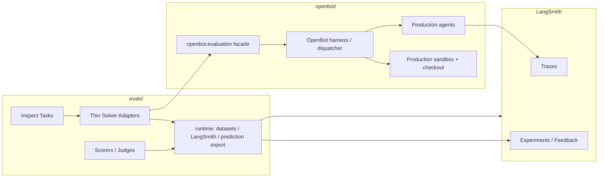

# OpenBot Eval · Product Requirements Document

> 版本：**3.0 Current-State Redesign** · 最近更新：2026-05-22 · 状态：设计已锁定 / 待实现
> 范围：v0.1 alpha ~ v0.3 评测体系
> 关联设计：[`docs/_archive/superpowers/2026-05-22-evals-runtime-redesign.md`](../_archive/superpowers/2026-05-22-evals-runtime-redesign.md)

## 0. 核心原则

**OpenBot eval 测产品行为，不测一个 eval-only agent。**

评测系统必须像外部测评台一样运行 OpenBot：`evals/` 只负责 sample、runner、scorer 和 LangSmith 记录；agent、model routing、sandbox、repo checkout、workflow harness 必须由 `openbot/` 产品代码负责。

这意味着：

| 边界 | 属于 evals | 属于 OpenBot |
|---|---|---|
| Dataset / benchmark 选择 | 是 | 否 |
| Inspect Task / Solver adapter | 是 | 否 |
| Scorer / judge / prediction export | 是 | 否 |
| LangSmith experiment upload | 是 | 否 |
| Agent prompt / tools / middleware | 否 | 是 |
| Sandbox provider / clone / checkout | 否 | 是 |
| Repository context injection | 否 | 是 |
| Workflow execution policy | 否 | 是 |

旧的 `evals/agents/*` 和 `evals/sandboxes/*` 是过渡层。它们用于早期跑通 benchmark，但现在会掩盖产品路径的问题，必须删除。

---

## 1. Executive Summary

| # | 问题 | 当前答案 |
|---|---|---|
| Q1 | 测什么 | Review、Fix、Chat、Test generation 四个外部静态 eval surface；Triage 延后到产品能力闭环后再接入 |
| Q2 | 用什么跑 | Inspect AI 负责 runner；OpenBot `openbot.evaluation` 负责真实产品执行；LangSmith 负责 trace / experiment / feedback |
| Q3 | 不再用什么 | 不再用 `evals/agents`、`evals/sandboxes`、`deepagents_baseline`、eval-owned sandbox/model config |
| Q4 | 如何判断可用 | 每个 eval surface 能调用 OpenBot 产品 facade，LangSmith 结果正常上传，prediction JSONL schema 继续有效 |
| Q5 | v0.1 alpha gate | Review / Fix / Chat 可跑一条 smoke；Test generation 在产品能力未实现前明确 `unsupported=true` |

---

## 2. v0.1 当前测评面

| Surface | Dataset | Task entry | Solver | Product path | Status |
|---|---|---|---|---|---|
| Review | Martian Code Review Bench mirror | `review_martian` | `solvers/review.py` | `openbot.evaluation.run_review_sample` | 保留并改造 |
| Fix | SWE-bench Verified | `fix_swe_bench` | `solvers/fix.py` | `openbot.evaluation.run_fix_sample` | 保留并改造 |
| Chat | SWE-QA-Pro | `chat_swe_qa` | `solvers/chat.py` | `openbot.evaluation.run_chat_sample` | 保留并改造 |
| Test generation | SWT-Bench Verified | `test_swt_bench` | `solvers/test_generation.py` | `openbot.evaluation.run_test_generation_sample` | surface 保留；产品能力未实现前 unsupported |

Triage 不作为当前 eval refactor 的主线，因为产品侧 triage 仍是 ACK-only / 未形成真实标签与优先级输出。等 triage 产品能力闭环后再加入 GitBugs 或内部标注集。

---

## 3. 架构边界



### 3.1 `evals/` 职责

- 定义 Inspect Task。
- 读取 LangSmith / HuggingFace / benchmark dataset。
- 调用 `openbot.evaluation`。
- 将 OpenBot 输出转换成 scorer / prediction schema。
- 上传 LangSmith experiment rows 和 feedback。
- 写出 SWE / SWT prediction JSONL。

### 3.2 `evals/` 禁止事项

- 禁止 import `evals.agents`。
- 禁止 import `evals.sandboxes`。
- 禁止 import `openbot.infrastructure.agents.*`。
- 禁止直接创建 Docker / Daytona / Modal sandbox。
- 禁止自己 clone repo 或注入 repo path。
- 禁止维护 eval-only prompt、DeepAgents factory、middleware、structured finalizer。

### 3.3 `openbot/` 职责

- 提供 `openbot/evaluation` facade。
- 使用真实 OpenBot model routing。
- 使用真实 OpenBot sandbox factory、checkout resolver、`SandboxedHandle`。
- 使用真实 production responder / workflow harness。
- 提供 offline eval 安全模式，避免在 benchmark 中真的 push branch / open PR。

---

## 4. 目标目录结构

```text
evals/
├── Makefile
├── README.md
├── runtime/
│   ├── __init__.py
│   ├── config.py
│   ├── datasets.py
│   ├── environment.py
│   ├── hf_datasets.py
│   ├── langsmith.py
│   ├── prediction_export.py
│   └── predictions.py
├── scorers/
│   ├── __init__.py
│   ├── review_judge.py
│   ├── review_overlap.py
│   ├── swe_qa_judge.py
│   └── swe_qa_score.py
├── solvers/
│   ├── __init__.py
│   ├── chat.py
│   ├── fix.py
│   ├── review.py
│   └── test_generation.py
├── tasks/
│   ├── __init__.py
│   ├── chat_swe_qa.py
│   ├── fix_swe_bench.py
│   ├── review_martian.py
│   └── test_swt_bench.py
├── scripts/
│   ├── __init__.py
│   ├── build_chat_swe_qa_dataset.py
│   ├── build_fix_swe_bench_dataset.py
│   ├── build_review_martian_dataset.py
│   ├── build_test_swt_bench_dataset.py
│   ├── writeback_swe_bench_grades.py
│   └── writeback_swt_bench_grades.py
└── third_party/
    └── swt_bench/
```

```text
openbot/evaluation/
├── __init__.py
├── adapters.py
├── results.py
├── runner.py
└── samples.py
```

---

## 5. 命名规范

### 5.1 稳定命名

| 层 | 命名依据 | 示例 |
|---|---|---|
| `tasks/` | benchmark / dataset | `fix_swe_bench.py`, `chat_swe_qa.py` |
| `solvers/` | OpenBot capability | `fix.py`, `chat.py` |
| `runtime/` | eval runner 支撑能力 | `langsmith.py`, `environment.py` |
| `scorers/` | scoring contract | `review_overlap.py`, `swe_qa_score.py` |
| `openbot/evaluation/` | 产品评测 facade | `runner.py`, `samples.py`, `results.py` |

### 5.2 禁用命名

```text
deepagents_baseline_*
*_openbot_prod
swe_fix.py
swe_test.py
swe_qa.py
task_runtime.py
docker_backend.py
daytona_backend.py
modal_backend.py
```

这些名字混合了 benchmark、能力、实现细节，后续扩展时会制造歧义。

---

## 6. LangSmith 契约

LangSmith 继续承担：

1. review / chat dataset mirror；
2. trace routing；
3. per-sample experiment row；
4. per-sample feedback；
5. fix / test prediction export metadata；
6. official grading 结果 writeback。

必填 metadata：

```text
dataset_version
solver_family = "openbot_agent"
solver_id = "review" | "fix" | "chat" | "test_generation"
capability = <solver_id>
openbot_git_sha
mode = "smoke" | "regression" | "weekly" | "release"
```

Test generation 未实现时必须写入：

```text
unsupported = true
unsupported_reason = "not_implemented"
```

---

## 7. 运行模式

| 模式 | 触发 | 目标 | 是否阻塞 |
|---|---|---|---|
| Smoke | 本地 / PR 手动 | 验证 task、dataset、OpenBot facade、LangSmith 上传没有坏 | 不阻塞 |
| Regression | agent / workflow / prompt / harness 改动后 | 发现明显退化 | review 可 hard gate；fix/chat 先 warn |
| Weekly | cron | 趋势观察 | 不阻塞 merge |
| Release | 发版前手动 | 形成可发布质量快照 | 可 block release |

同步 CI 不跑昂贵完整 eval。CI 可以跑单样本 smoke 和 unit tests。

---

## 8. SLO 与 Gate

| Gate | 监控指标 | 阈值 | 行为 |
|---|---|---|---|
| Runner Health | task import + one-sample smoke | 必须通过 | Block eval refactor merge |
| LangSmith Upload | experiment row + feedback | 必须存在 | Block eval refactor merge |
| Review Regression | Martian mean F1 | 相对下降 ≥ 10% | Block prompt/review-agent merge |
| Fix Export | valid SWE prediction JSONL | 必须通过 schema | Block eval runner merge |
| Chat Judge | SWE-QA-Pro judge result present | 必须存在 | Warn until chat tools complete |
| Unsupported Test Generation | `unsupported=true` metadata | 必须存在 | Block if silently uses old agent |

---

## 9. 删除 / 迁移清单

### 9.1 删除

```text
evals/agents/
evals/sandboxes/
```

### 9.2 合并

```text
evals/common/config.py              -> evals/runtime/config.py
evals/common/datasets.py            -> evals/runtime/datasets.py
evals/common/prediction_export.py   -> evals/runtime/prediction_export.py
evals/common/predictions.py         -> evals/runtime/predictions.py
evals/inspect/hf_datasets.py        -> evals/runtime/hf_datasets.py
evals/inspect/langsmith.py          -> evals/runtime/langsmith.py
evals/inspect/task_runtime.py       -> evals/runtime/environment.py
```

### 9.3 删除 eval-owned agent / sandbox config

```text
OPENBOT_DEEPAGENTS_MODEL
OPENBOT_DEEPAGENTS_MODEL_CALL_LIMIT
OPENBOT_DEEPAGENTS_TOOL_CALL_LIMIT
OPENBOT_DEEPAGENTS_RECURSION_LIMIT
OPENBOT_DEEPAGENTS_MODEL_TIMEOUT_S
OPENBOT_DEEPAGENTS_MODEL_MAX_RETRIES
OPENBOT_DEEPAGENTS_MAX_OUTPUT_TOKENS
OPENBOT_DEEPAGENTS_THINKING_LEVEL
OPENBOT_SANDBOX_BACKEND
OPENBOT_DAYTONA_IMAGE
OPENBOT_MODAL_IMAGE
OPENBOT_MODAL_APP
```

模型和 sandbox 配置归 OpenBot 产品 settings / repo config 所有。

---

## 10. v0.1 Alpha Acceptance

1. `evals/` 没有 agent factory、sandbox backend、repo clone 实现。
2. `evals/solvers/*` 只通过 `openbot.evaluation` 调用产品能力。
3. Review / Fix / Chat 各能跑一条 smoke sample。
4. Test generation 不再使用旧 agent；产品能力未实现前输出 `unsupported=true`。
5. LangSmith experiment row 和 feedback 正常上传。
6. SWE / SWT prediction JSONL schema 仍然可验证。
7. `uv run pytest tests/eval tests/evaluation` 通过。
