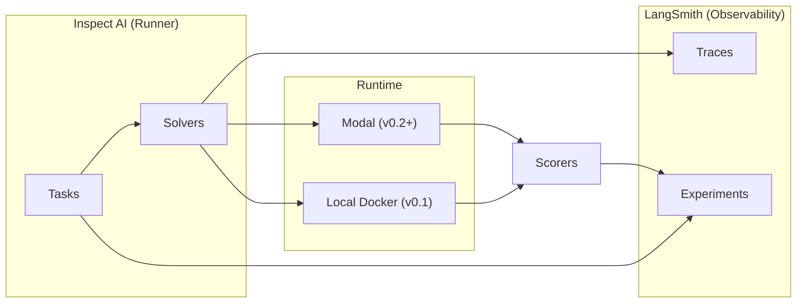

# OpenBot Eval · Product Requirements Document

> 版本：**2.2** · 状态：可执行 · 范围：v0.1 ~ v0.3 评测体系

## 0. 核心原则

**OpenBot eval 测产品输出（product behavior），不测模型能力（model capability）。**

| 阶段 | 数据来源 | Ground truth | 触发条件 |
|---|---|---|---|
| **v0.1 外部静态** | 公开 dataset | dataset 自带 | 立即可跑 |
| **v0.2 内部 curated** | bot 历史输出 | maintainer 手工标注 | **单业务样本 ≥ 200** |
| **v0.3 在线** | 生产流量采样 | 隐式信号 (Merge/Thumbs) | **月活 ≥ 30 repo** |

---

## 1. Executive Summary

| # | 问题 | 答案 |
|---|---|---|
| Q1 | **测什么** | 4 业务 × 3 阶段主矩阵（Triage, Review, Fix, Chat） |
| Q2 | **用什么测** | Runner: Inspect AI · Trace/Experiment: LangSmith · Sandbox: Local Docker / Modal |
| Q3 | **何时测** | Smoke (PR/Local) · Regression (PR async) · Weekly (Cron) · Release (Manual) |
| Q4 | **准入/准出** | 按 SLO 表执行 Hard (Block merge) / Soft (Warn) 门禁 (§5) |

### 1.1 v0.1 基线实现状态

| Surface | Task Entry | Solver | Sandbox | Scorer |
|---|---|---|---|---|
| **Review** | `review_martian_baseline_crb` | `deepagents_baseline` | none | Martian-overlap (F1) |
| **Fix** | `fix_swe_bench_verified_deepagents` | `deepagents_baseline` | Local Docker | JSONL Export (Offline Grading) |
| **Test** | `test_swt_bench_verified_deepagents` | `deepagents_baseline` | Local Docker | custom `swt_bench_scorer` |
| **Chat** | `chat_swe_qa_pro_openbot` | `deepagents_agent` (+Agent) | Local Docker | SWE-QA-Pro 5-dim judge |

---

## 2. 业务矩阵与解冻 Gate

| 业务 | v0.1 外部静态 | v0.2 内部 curated (Gate: ≥ 200 samples) | v0.3 在线 (Gate: ≥ 30 repo) |
|---|---|---|---|
| **Triage** | `gitbugs` | `triage_internal_v1` | `triage_internal_online` |
| **Review** | `review_codereviewbench` | `review_internal_v1` | `review_codereviewbench_online` |
| **Fix** | `fix_swe_bench_verified` | `fix_internal_v1` | `fix_swe_bench_live` |
| **Chat** | `chat_swe_qa_pro` | `chat_internal_v1` | `chat_internal_online` |

---

## 3. 架构与组件边界



- **Inspect AI**: 负责 Task 编排、Sample 调度与 Scorer 调用。
- **LangSmith**: 负责 Trace 存储、实验对比、成本统计及在线评测。
- **DeepAgents**: 提供 Solver 实现，**自主管理** Sandbox 生命周期。
- **Sandbox**: 公开 Benchmark 走 Local Docker；生产/内部评测走 Modal。

---

## 4. 运行模式与 Path Matcher

### 4.1 触发规则 (PR)

| 改动路径 | 触发 Suite (v0.1) | 限制 |
|---|---|---|
| `workflows/review*` | `review_codereviewbench` | limit 10 |
| `workflows/fix*` | `fix_swe_bench_verified` | limit 10 |
| `workflows/chat*` | `chat_swe_qa_pro` | limit 20 |
| `evals/**` | 对应全量 Suite | none |

### 4.2 本地操作入口

```bash
make -C evals smoke         # 跑全业务 smoke (limit 5)
make -C evals check         # pytest + smoke
make -C evals view-open     # 启动 Inspect 可视化看板
```

---

## 5. Gating Policy (SLO 表)

| Gate | 监控指标 | 阈值 | 行为 |
|---|---|---|---|
| **Review Regression** | `review_codereviewbench` mean_f1 | ↓ ≥ 10% | **Block Merge** |
| **Fix/Chat Regression** | `fix_swe_bench_verified` / `chat_swe_qa_pro` | ↓ ≥ 5% | Warn |
| **Cost Ceiling** | per-suite cost vs budget | > 120% | Abort Run |
| **Internal Hold** | `v0.2` 系列 Suite 成功率 | < Floor | Warn |

---

## 6. LangSmith 契约与成本控制

### 6.1 必填 Metadata
- `suite_version`, `dataset_version`, `git_sha`, `model_id`, `judge_model_id`, `mode` (smoke/regression/release)。

### 6.2 Budget Guardrails
- **Per Sample**: Fix ($1.5), Review ($0.6), Chat ($0.1)。
- **Monthly Limit**: 单实例 $1500，超限自动停止所有 Eval Workflow。

---

## 7. 存储布局 (evals/)

- `tasks/`: 定义 Inspect Task 接入点。
- `solvers/`: 实现业务逻辑 (DeepAgents)。
- `scorers/`: 实现评测算法与 Judge 逻辑。
- `sandboxes/`: Docker/Modal 环境初始化逻辑。
- `common/`: LangSmith 实验投影与 Dataset 加载通用函数。
