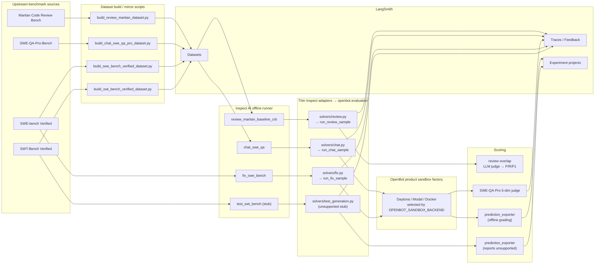

# OpenBot evals

This directory contains the **currently implemented** offline eval surfaces for OpenBot.
It documents the code that exists today, not the full target-state described in the PRD.

At a high level:

- **Inspect AI** is the offline runner: it owns `Task`, `Solver`, `Scorer`, sample execution, and `.inspect/logs/...`.
- **OpenBot product code** owns the agent framework. Eval solvers are thin Inspect adapters that call `openbot.evaluation.run_*_sample(...)`; the agent loop, sandbox lifecycle, and model routing live in `openbot/`.
- **LangSmith** has two roles:
  - source-of-truth dataset storage for the `review` and `chat` evals;
  - tracing / experiment projection for all evals where wired.
- **Sandbox** is provisioned by the OpenBot product factory (Daytona / Modal / Docker, selected via `OPENBOT_SANDBOX_BACKEND`). Eval code does not own sandboxes.

## Current architecture



## What is implemented today

| Surface | Task entry | Runtime dataset source | Solver | Sandbox | Scorer | Status |
|---|---|---|---|---|---|---|
| Review | `review_martian_baseline_crb` | LangSmith `martian_2026w20` | `evals/solvers/review.py` -> `openbot.evaluation.run_review_sample` | none | Martian-compatible overlap scorer (`precision / recall / F1`) | implemented |
| Fix | `fix_swe_bench` | HF `princeton-nlp/SWE-bench_Verified` | `evals/solvers/fix.py` -> `openbot.evaluation.run_fix_sample` | OpenBot product factory (Daytona / Modal / Docker) | `prediction_exporter` (offline grading) | implemented |
| Test generation | `test_swt_bench` | HF `eth-sri/SWT-bench_Verified_bm25_27k_zsb` | `evals/solvers/test_generation.py` (unsupported stub) | n/a | `prediction_exporter` (always reports unsupported) | stub |
| Chat / repo QA | `chat_swe_qa` | LangSmith `chat_swe_qa_pro_v1` | `evals/solvers/chat.py` -> `openbot.evaluation.run_chat_sample` | OpenBot product factory | SWE-QA-Pro 5-dim judge | implemented |

## How each flow works

### 1. Review: `review_martian_baseline_crb`

1. `build_review_martian_dataset.py` mirrors the pinned Martian benchmark into LangSmith.
2. `evals/tasks/review_martian.py` materializes that LangSmith dataset into an Inspect `MemoryDataset`.
3. `evals/solvers/review.py` calls `openbot.evaluation.run_review_sample(...)`, which exercises the production `DeepAgentsReviewResponder` over each PR diff.
4. The solver stores parsed findings in `state.metadata["candidate_findings"]`.
5. The task-local overlap scorer compares those findings with gold findings using the Martian-compatible judge and returns `precision`, `recall`, and `f1`.

There is **no sandbox** in this flow because the model only reads a diff and emits review findings.

### 2. Fix: `fix_swe_bench`

1. The task loads the SWE-bench dataset from HuggingFace.
2. The OpenBot product sandbox factory provisions a sandbox cloned at `base_commit` (Daytona by default; Modal / Docker swappable via `OPENBOT_SANDBOX_BACKEND`).
3. `evals/solvers/fix.py` calls `openbot.evaluation.run_fix_sample(...)`, which exercises the production `DeepAgentsFixResponder`.
4. `prediction_exporter` captures the `git diff` and appends it to `evals/outputs/.../*.predictions.jsonl`.
5. **Real grading is offline** via the official SWE-bench Docker harness.

### 3. Test generation: `test_swt_bench`

1. The task loads the SWT-Bench Verified dataset.
2. The solver is currently a stub: it emits an empty `SwtBenchPrediction` with `unsupported=true` until OpenBot product code grows a test-generation responder.
3. The vendored SWT-Bench harness (`evals/third_party/swt_bench/`) is still wired for offline grading once a real solver lands.

### 4. Chat / repo QA: `chat_swe_qa_pro_openbot`

### 4. Chat / repo QA: `chat_swe_qa`

1. `build_chat_swe_qa_pro_dataset.py` mirrors SWE-QA-Pro-Bench into LangSmith.
2. The task loads it from LangSmith.
3. `evals/solvers/chat.py` calls `openbot.evaluation.run_chat_sample(...)`, which exercises the production `DeepAgentsChatResponder`.
4. The OpenBot product sandbox factory provisions a sandbox where the repo is cloned.
5. The agent uses `ls`, `grep`, `read_file` to browse the code before answering.
6. `swe_qa_pro_judge_scorer()` calls the 5-dimension judge for scoring.

## Sandbox boundary

The eval solvers themselves do **not** own a sandbox. They obtain one
from the OpenBot product factory
(`openbot.application.sandbox_factory_deps.build_sandbox_factory`) and
pass it to `openbot.evaluation.run_fix_sample(...)`:

```text
Inspect Task
  -> evals/solvers/fix.py (thin adapter)
  -> openbot.evaluation.run_fix_sample(sandbox=<from openbot product factory>)
  -> Daytona / Modal / Docker backend (selected via OPENBOT_SANDBOX_BACKEND)
```

Inspect AI owns the Task orchestration; **OpenBot owns the sandbox
lifecycle**. This is the inversion that motivated the Phase 1/2
refactor: evals are no longer a parallel implementation of the agent
loop — they call the same code path production triage/review/fix
agents do.

## LangSmith behavior

There are three distinct LangSmith integrations in the current code:

1. **Dataset storage**
   - runtime source for `martian_2026w20`
   - runtime source for `chat_swe_qa_pro_v1`
   - mirror-only storage for `fix_swe_bench_verified`
   - mirror-only storage for `test_swt_bench_verified`

2. **Trace routing**
   - `evals.inspect.langsmith.configure_tracing_for_dataset(...)` enables LangSmith tracing
   - `LANGSMITH_EVAL_PROJECT` is the single project override for eval agent and judge traces

3. **Experiment / feedback projection**
   - `evals.runtime.langsmith.LangSmithExperiment.wrap(...)` projects per-sample SWE-bench / SWT-Bench results into LangSmith Experiment projects
   - `swe_qa_pro_judge_scorer()` attaches per-dimension feedback to the live LangSmith trace

## Directory map

```text
evals/
├── runtime/                            # Inspect-side glue (was common/ + inspect/)
│   ├── config.py                       # eval-only settings: judge model, paths, LS routing
│   ├── datasets.py                     # LangSmith Example -> Inspect Sample
│   ├── hf_datasets.py                  # HuggingFace row -> Inspect Sample
│   ├── langsmith.py                    # trace routing + Inspect -> LangSmith Experiment bridge
│   ├── environment.py                  # build_export_experiment / git_sha / model label
│   ├── predictions.py                  # SweBenchPrediction / SwtBenchPrediction / SweQaProAnswer
│   └── prediction_export.py            # @scorer that appends to predictions.jsonl
├── solvers/                            # thin Inspect adapters calling openbot.evaluation
│   ├── review.py                       # -> openbot.evaluation.run_review_sample
│   ├── fix.py                          # -> openbot.evaluation.run_fix_sample
│   ├── chat.py                         # -> openbot.evaluation.run_chat_sample
│   └── test_generation.py              # stub: emits unsupported-capability prediction
├── tasks/                              # Inspect AI @task definitions
│   ├── review_martian.py
│   ├── fix_swe_bench.py
│   ├── test_swt_bench.py
│   └── chat_swe_qa.py
├── scorers/
│   ├── review_overlap.py               # review overlap math
│   ├── review_judge.py                 # Martian-CRB LLM-as-judge
│   ├── swe_qa_judge.py                 # SWE-QA-Pro 5-dim judge
│   ├── swe_qa_pro.py                   # @scorer wrapping the 5-dim judge
│   └── _judge_client.py                # cached ChatAnthropic for judges
├── scripts/
│   ├── build_review_martian_dataset.py
│   ├── build_chat_swe_qa_pro_dataset.py
│   ├── build_swe_bench_verified_dataset.py
│   ├── build_swt_bench_verified_dataset.py
│   ├── writeback_swe_grades.py         # offline SWE-bench grade -> LangSmith
│   └── writeback_swt_grades.py         # offline SWT-Bench grade -> LangSmith
└── third_party/
    └── swt_bench/                      # vendored SWT-Bench Docker harness
        └── _docker_ssh.py               # macOS-friendly Docker-over-SSH shim
```

The sandbox lifecycle (`DaytonaSandboxBackend`, `DockerSandboxBackend`,
`ModalSandboxBackend`) is **not** an eval concern — it lives in
`openbot/infrastructure/sandboxes/` and the eval solver receives one
through the OpenBot product factory.

## Makefile entry points

Eval workflows live in `evals/Makefile`, not the repo-root `Makefile`.

From the repo root:

```bash
# discover commands
make -C evals help

# publish datasets safely; existing LangSmith datasets make the target stop
make -C evals data

# explicitly rebuild all four datasets
make -C evals data-refresh

# run eval-only pytest coverage
make -C evals test

# run all four implemented live smoke evals
make -C evals smoke

# tests first, then live smoke evals
make -C evals check

# build the Inspect static viewer bundle from eval logs
make -C evals view-bundle

# build + serve + open the Inspect viewer in one step
make -C evals view-open
```

Useful per-surface targets:

```bash
make -C evals data-review
make -C evals data-chat
make -C evals data-fix
make -C evals data-test

make -C evals smoke-review
make -C evals smoke-fix
make -C evals smoke-test
make -C evals smoke-chat
make -C evals view-stop
```

Tunables:

```bash
# change the smoke sample count
make -C evals smoke LIMIT=3

# change coding-model ids without editing the Makefile
OPENBOT_MODEL=mimo-v2.5 make -C evals smoke-fix
OPENBOT_MODEL=mimo-v2.5 make -C evals smoke-test

# point the viewer at Makefile-produced smoke logs or a different port
make -C evals view-open VIEW_LOG_DIR=evals/logs VIEW_OUTPUT_DIR=evals/logs-www
make -C evals view-open VIEW_PORT=8124
```

## Reliability: timeouts, retries, and resume

Evals talk to flaky model endpoints — a half-closed TCP socket from a
provider mid-completion would previously hang a sample indefinitely. Two
layers of defense, each independently tunable, plus a checkpoint-style
resume.

### Layer 1 — HTTP-client timeout + retries (per request)

Every LLM call is constructed through `build_agent_chat_model(...)` in
[`openbot/infrastructure/agents/runtime.py`](../openbot/infrastructure/agents/runtime.py),
which sets explicit `timeout` and `max_retries` on the provider httpx
client. Defaults: **90 s timeout, 3 retries** on retryable HTTP errors
(429 / 5xx / connection drops). Eval solvers inherit this exactly
because they call the same `openbot.evaluation.run_*_sample` path
production agents use — no parallel chat-model construction lives in
`evals/`.

```bash
# per-request HTTP timeout — applies to every model call
OPENBOT_MODEL_TIMEOUT_S=60 make -C evals smoke-review

# HTTP-layer retry count for transient errors (429 / 5xx / network)
OPENBOT_MODEL_MAX_RETRIES=5 make -C evals smoke-review
```

### Layer 2 — Inspect per-sample resilience

`INSPECT_FLAGS` includes `--no-fail-on-error --score-on-error
--retry-on-error=2 --attempt-timeout 180 --max-samples 4` by default,
so:

- A poisoned sample doesn't kill 49 healthy ones (`--no-fail-on-error`).
- Errored samples score 0 in the aggregate rather than disappearing
  (`--score-on-error`).
- Each sample gets up to 2 sample-level retries after the HTTP layer
  gives up (`--retry-on-error=2`).
- A single model attempt that takes longer than 180 s is abandoned and
  retried (`--attempt-timeout 180`).
- At most 4 samples run concurrently — avoids stampeding a rate-limited
  endpoint (`--max-samples 4`).

Override at the Make command line:

```bash
# tighter sample-level retry, smaller concurrency for a flaky endpoint
make -C evals smoke-review RETRY_ON_ERROR=4 MAX_SAMPLES=2 ATTEMPT_TIMEOUT=90

# disable the resilience floor (strict mode — fail fast on first error)
make -C evals smoke-review RESILIENCE_FLAGS="--max-samples 4"
```

The two layers are independent on purpose: HTTP retries keep the agent
loop alive through transient provider blips without losing context;
sample retries rerun the whole agent from scratch when an error escapes
that layer.

### Resume a partial / errored run

`inspect eval-retry` reads a `.eval` log, identifies samples that
errored or never completed, and re-runs **just those**. Cleanly-scored
samples are skipped — so a 50-sample run that was killed at sample 23
resumes at 24, and a run where 7 samples errored gets exactly 7 reruns.

```bash
# resume the most recent partial run under evals/logs/
make -C evals resume

# resume an explicit log
make -C evals resume LOG=evals/logs/20260516-165534-review-full/-I*.eval
```

Resume inherits the same resilience flags as the original run.

## Current limits

- No production `openbot_prod` solver is implemented yet for review or chat; those task entries are deliberate placeholders.
- `review` uses no sandbox; it is a closed-form baseline.
- The SWT-Bench integration is local to this repo: it reuses Inspect's task/plumbing but the scorer is custom.
