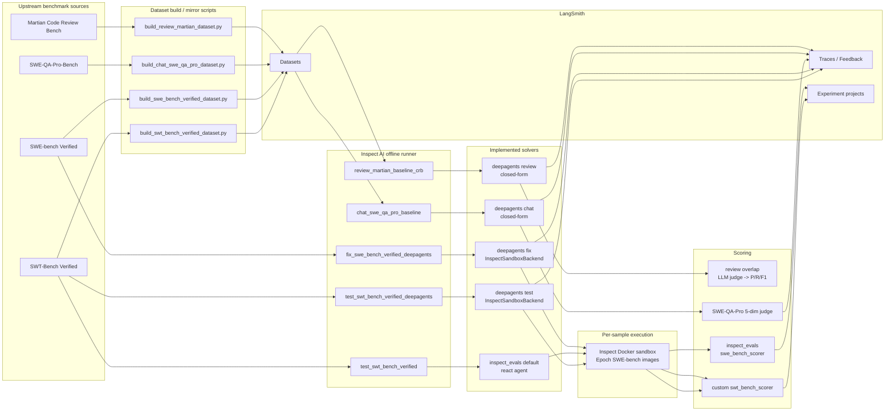

# OpenBot evals

This directory contains the **currently implemented** offline eval surfaces for OpenBot.
It documents the code that exists today, not the full target-state described in the PRD.

At a high level:

- **Inspect AI** is the offline runner: it owns `Task`, `Solver`, `Scorer`, sample execution, and `.inspect/logs/...`.
- **DeepAgents** is the current baseline agent framework used by every implemented OpenBot-side solver.
- **LangSmith** has two roles:
  - source-of-truth dataset storage for the `review` and `chat` evals;
  - tracing / experiment projection for all evals where wired.
- **Inspect's Docker sandbox** is used only by the code-editing evals (`fix` / `test`), with a small bridge that lets DeepAgents use the same per-sample sandbox.

## Current architecture



The important split is:

- `review_martian` and `chat_swe_qa_pro` **load their runtime samples from LangSmith** through `evals.common.datasets.langsmith_dataset(...)`.
- `fix_swe_bench_verified` and `test_swt_bench_verified` **load their runtime samples from upstream benchmark datasets** through `inspect_evals.swe_bench.swe_bench(...)`; their LangSmith datasets are mirrors used so per-sample results can appear in the LangSmith Experiments view.

## What is implemented today

| Surface | Task entry | Runtime dataset source | Solver | Sandbox | Scorer | Status |
|---|---|---|---|---|---|---|
| Review | `review_martian_baseline_crb` | LangSmith `martian_2026w20` | DeepAgents baseline review solver | none | Martian-compatible overlap scorer (`precision / recall / F1`) | implemented |
| Review | `review_martian_openbot` | same intended surface | future `openbot_prod` | n/a | same intended scorer | reserved; raises `NotImplementedError` |
| Fix | `fix_swe_bench_verified_deepagents` | HF `princeton-nlp/SWE-bench_Verified` via `inspect_evals.swe_bench` | DeepAgents baseline fix solver | Inspect Docker | upstream `swe_bench_scorer` | implemented |
| Test generation | `test_swt_bench_verified` | HF `eth-sri/SWT-bench_Verified_bm25_27k_zsb` via `inspect_evals.swe_bench` | upstream `inspect_evals` react agent | Inspect Docker | custom `swt_bench_scorer` | implemented |
| Test generation | `test_swt_bench_verified_deepagents` | same SWT-Bench dataset | DeepAgents baseline test solver | Inspect Docker | custom `swt_bench_scorer` | implemented |
| Chat / repo QA | `chat_swe_qa_pro_baseline` | LangSmith `chat_swe_qa_pro_v1` | DeepAgents direct-answer baseline | none | SWE-QA-Pro 5-dim judge | implemented |
| Chat / repo QA | `chat_swe_qa_pro_openbot` | same intended surface | future `openbot_prod` | n/a | same intended scorer | reserved; raises `NotImplementedError` |

## How each flow works

### 1. Review: `review_martian_baseline_crb`

1. `build_review_martian_dataset.py` mirrors the pinned Martian benchmark into LangSmith.
2. `evals/tasks/review_martian.py` materializes that LangSmith dataset into an Inspect `MemoryDataset`.
3. `evals/solvers/review.py` runs a closed-form DeepAgents review prompt over each PR diff.
4. The solver stores parsed findings in `state.metadata["candidate_findings"]`.
5. The task-local overlap scorer compares those findings with gold findings using the Martian-compatible judge and returns `precision`, `recall`, and `f1`.

There is **no sandbox** in this flow because the model only reads a diff and emits review findings.

### 2. Fix: `fix_swe_bench_verified_deepagents`

1. `inspect_evals.swe_bench.swe_bench(...)` provides the SWE-bench dataset shape, Docker sandbox spec, and upstream scoring contract.
2. The task swaps in `deepagents_baseline_swe_solver()` after constructing the upstream task.
3. `InspectSandboxBackend` adapts Inspect's per-sample Docker sandbox to the DeepAgents backend protocol, giving the agent `ls`, `read_file`, `glob`, `grep`, `write_file`, `edit_file`, and `execute`.
4. The agent edits the checked-out repo inside the sandbox.
5. Upstream `swe_bench_scorer()` recovers the patch via `git diff`, runs benchmark validation, and emits pass/fail.
6. `LangSmithExperiment.wrap(...)` replays the same per-sample score into a LangSmith Experiment project linked to the mirrored LangSmith dataset.

Here, **Inspect owns the sandbox and the benchmark harness**; DeepAgents is only the solver driving the coding behavior inside that sandbox.

### 3. Test generation: `test_swt_bench_verified*`

1. The task reuses `inspect_evals.swe_bench.swe_bench(...)` with the SWT-Bench Verified HF dataset because the rows preserve the SWE-bench schema and instance ids.
2. The default task keeps the upstream react-style solver; the DeepAgents variant swaps in `deepagents_baseline_swt_solver()`.
3. Both variants run inside the same Inspect Docker sandbox family as SWE-bench.
4. The custom `swt_bench_scorer()`:
   - rejects any model patch that touches non-test files;
   - runs the generated test against buggy code and expects `FAIL / ERROR`;
   - applies the gold code patch;
   - reruns F2P plus a bounded P2P sample and expects `PASS`;
   - returns `1.0` only when the full pre-gold / post-gold transition holds.
5. The wrapped scorer also projects results into LangSmith Experiments.

This means SWT-Bench is **not scored by the generic SWE-bench scorer** in this repo.  
It reuses the SWE-bench task/sandbox infrastructure but has its **own grader**.

### 4. Chat / repo QA: `chat_swe_qa_pro_baseline`

1. `build_chat_swe_qa_pro_dataset.py` mirrors SWE-QA-Pro-Bench into LangSmith.
2. The task loads it from LangSmith into an Inspect `MemoryDataset`.
3. The current solver is a DeepAgents direct-answer baseline with no tools and no sandbox.
4. `swe_qa_pro_judge_scorer()` calls the development 5-dimension judge: it uses the official Appendix D prompt text, but intentionally keeps the Anthropic single-call dev deviations explicit in metadata; then it normalizes `overall / 50` into `[0, 1]` and stores the raw 5-dim scores in metadata.
5. The scorer best-effort attaches per-dimension feedback to the sample's LangSmith trace.

## Sandbox boundary

The repo currently uses **one real eval sandbox path**:

```text
DeepAgents solver
  -> InspectSandboxBackend
  -> inspect_ai.util.sandbox()
  -> per-sample Inspect Docker container
```

`InspectSandboxBackend` is a bridge, not a second sandbox provider. It lets a DeepAgents agent use its richer file-aware tool surface while still executing inside the Docker container that Inspect created for the benchmark sample.

So, for the implemented coding evals:

- **Inspect AI owns the container lifecycle**.
- **DeepAgents owns the agent loop and tool choice**.
- **The scorer owns the benchmark-specific pass/fail rule**.

## LangSmith behavior

There are three distinct LangSmith integrations in the current code:

1. **Dataset storage**
   - runtime source for `martian_2026w20`
   - runtime source for `chat_swe_qa_pro_v1`
   - mirror-only storage for `fix_swe_bench_verified`
   - mirror-only storage for `test_swt_bench_verified`

2. **Trace routing**
   - `configure_tracing_for_dataset(...)` sends public datasets to `LANGSMITH_PROJECT_PUBLIC`
   - every other dataset falls back to `LANGSMITH_PROJECT_INTERNAL`

3. **Experiment / feedback projection**
   - `LangSmithExperiment.wrap(...)` projects per-sample SWE-bench / SWT-Bench results into LangSmith Experiment projects
   - `swe_qa_pro_judge_scorer()` attaches per-dimension feedback to the live LangSmith trace

## Directory map

```text
evals/
├── common/
│   ├── datasets.py                  # LangSmith dataset -> Inspect MemoryDataset
│   ├── deepagents_baseline.py       # shared DeepAgents baseline factory
│   ├── langsmith.py                 # public/internal trace routing
│   └── langsmith_experiments.py     # Inspect score -> LangSmith Experiment bridge
├── scorers/
│   ├── review_overlap.py            # review overlap math
│   ├── swt_bench_scorer.py          # SWT-Bench Success metric
│   └── swe_qa_pro.py                # SWE-QA-Pro judge wrapper
├── solvers/
│   ├── review.py                    # review baseline
│   ├── swe_fix.py                   # SWE-bench fixing baseline
│   ├── swe_test.py                  # SWT-Bench test-writing baseline
│   ├── swe_qa.py                    # SWE-QA-Pro direct-answer baseline
│   └── inspect_sandbox_backend.py   # DeepAgents -> Inspect sandbox bridge
├── scripts/
│   ├── build_review_martian_dataset.py
│   ├── build_chat_swe_qa_pro_dataset.py
│   ├── build_swe_bench_verified_dataset.py
│   └── build_swt_bench_verified_dataset.py
└── tasks/
    ├── review_martian.py
    ├── fix_swe_bench_verified.py
    ├── test_swt_bench_verified.py
    └── chat_swe_qa_pro.py
```

## Makefile entry points

Eval workflows live in `evals/Makefile`, not the repo-root `Makefile`.

From the repo root:

```bash
# discover commands
make -C evals help

# publish datasets safely; existing LangSmith datasets make the target stop
make -C evals data

# explicitly rebuild all four datasets
make -C evals data-refresh

# run eval-only pytest coverage
make -C evals test

# run all four implemented live smoke evals
make -C evals smoke

# tests first, then live smoke evals
make -C evals check

# build the Inspect static viewer bundle from eval logs
make -C evals view-bundle

# build + serve + open the Inspect viewer in one step
make -C evals view-open
```

Useful per-surface targets:

```bash
make -C evals data-review
make -C evals data-chat
make -C evals data-fix
make -C evals data-test

make -C evals smoke-review
make -C evals smoke-fix
make -C evals smoke-test
make -C evals smoke-chat
make -C evals view-stop
```

Tunables:

```bash
# change the smoke sample count
make -C evals smoke LIMIT=3

# change coding-model ids without editing the Makefile
OPENBOT_DEEPAGENTS_MODEL=mimo-v2.5 make -C evals smoke-fix
OPENBOT_DEEPAGENTS_MODEL=mimo-v2.5 make -C evals smoke-test

# point the viewer at Makefile-produced smoke logs or a different port
make -C evals view-open VIEW_LOG_DIR=evals/logs VIEW_OUTPUT_DIR=evals/logs-www
make -C evals view-open VIEW_PORT=8124
```

## Current limits

- No production `openbot_prod` solver is implemented yet for review or chat; those task entries are deliberate placeholders.
- The implemented fix task currently exposes only the DeepAgents variant, even though the module docstring still mentions an upstream react baseline sibling.
- `review` and `chat` currently use no sandbox; they are closed-form baselines.
- The SWT-Bench integration is local to this repo: it reuses Inspect's SWE-bench task/sandbox plumbing, but the scorer is custom.
